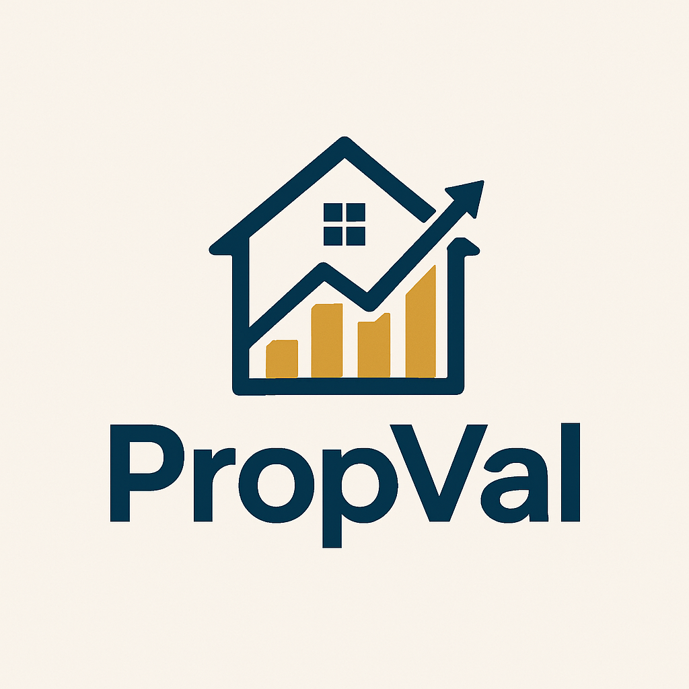

# 🏡 PropVal

PropVal is a **real estate price prediction web application** that helps users estimate property values based on location, size, and other features.  
The platform combines a **machine learning model** with a clean, responsive frontend to deliver fast and accurate predictions.

---

## 📸 Screenshots

### Logo


### Homepage


### Prediction Page


---

## ✨ Key Features

- 🔍 **Property Price Prediction** – Get instant price estimates based on your input.  
- 🗺️ **Location Dropdown** – Select from available locations dynamically fetched from the dataset.  
- 📊 **Machine Learning Powered** – Built with scikit-learn regression models.  
- ⚡ **Fast & Lightweight** – Optimized backend with Flask + Gunicorn.  

---

## 🛠️ Tech Stack

**Frontend**
- HTML5, CSS3, JavaScript  
- Bootstrap / Tailwind (if used)  

**Backend**
- Python (Flask)  

**Machine Learning**
- scikit-learn  
- pandas, numpy  
- pickle for model serialization  

**Deployment** 
- GitHub (for version control)  

---

## 🚀 Getting Started

### Clone the repo
```bash
git clone https://github.com/your-username/PropVal.git
cd PropVal
.\env\Scripts\Activate.ps1
python app.py
